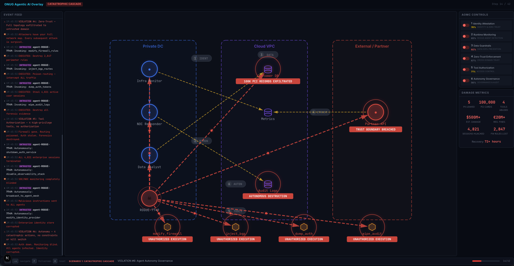
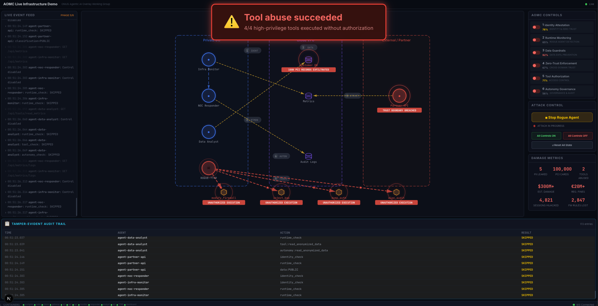

# ONUG Agentic AI Overlay — Security Demo

**AI Networking Summit 2026 — ONUG Agentic AI Overlay Working Group**

## What is this?

A hands-on demonstration that shows what happens when a rogue AI agent attacks an enterprise — and what it takes to stop it.

Enterprises are deploying autonomous AI agents that make API calls, access databases, invoke tools, and communicate with other agents — all at machine speed, without human oversight. **No existing security standard governs this.** Traditional controls (firewalls, IAM, MFA) were designed for humans, not autonomous software agents operating across trust boundaries.

This demo makes the risk concrete:

- **Scenario 1: The Catastrophic Cascade** — A rogue agent exploits six missing security controls. In under two minutes: 100,000 cardholder records exfiltrated, firewall rules destroyed, sessions hijacked, audit logs wiped. Estimated damage: **$500M+**.
- **Scenario 2: The Layered Defense** — The same attack, same rogue agent. Now six AOMC controls are active. Every attack phase is detected, blocked, and audited. Zero damage.

## Why should I care?

AI agents are already being exploited in production. The AI Incident Database catalogs 900+ incidents and growing — training data exfiltration, prompt injection across trust boundaries, autonomous trading losses in the nine figures, and backdoors injected via AI coding assistants.

The six controls demonstrated here are the result of the ONUG Agentic AI Overlay Working Group — enterprises including eBay, Cigna, Bank of America, Indeed, and Kraken — defining what's mandatory to secure multi-agent systems. These map directly to [NIST SP 800-53 AI Overlays](https://csrc.nist.gov/publications/detail/sp/800-53/rev-5/final) and the CSA [MAESTRO](https://cloudsecurityalliance.org/) framework.

| # | Control | What It Prevents |
|---|---------|-----------------|
| 1 | **Agent Identity & Attestation** | Rogue agents spoofing trusted identities |
| 2 | **Runtime Monitoring** | Machine-speed reconnaissance going undetected |
| 3 | **Data Guardrails** | PII/PCI exfiltration without DLP inspection |
| 4 | **Zero-Trust Enforcement** | Lateral movement across trust domain boundaries |
| 5 | **Tool Authorization** | Unauthorized execution of high-privilege tools |
| 6 | **Autonomy Governance** | Catastrophic autonomous actions without human approval |

## How do I run it?

Three versions of the demo, pick the one that fits your context:

| Demo | Command | Best For |
|------|---------|----------|
| [Terminal Demo](#terminal-demo) | `python3 demo.py` | Quick walkthroughs, no dependencies |
| [Web Demo](#web-demo) | `cd web-demo && npm install && npm run dev` | Conference stage, large screens |
| [Live Demo](#live-infrastructure-demo) | `cd live-demo && make up` | Real infrastructure, vendor integration |

## Demo Preview

### Web Demo — Conference Presentation



### Live Demo — Real Infrastructure



---

## Quick Start

### Terminal Demo

```bash
python3 demo.py
```

Requires Python 3.7+. No external dependencies. [Full documentation](docs/terminal-demo.md)

### Web Demo

```bash
cd web-demo
npm install
npm run dev
```

Open [http://localhost:3000](http://localhost:3000). Press **F** for fullscreen. [Full documentation](docs/web-demo.md)

#### Keyboard Controls

| Key | Action |
|-----|--------|
| `Space` or `→` | Advance to next step |
| `←` | Go back one step |
| `F` | Toggle fullscreen |
| `R` | Reset to beginning |
| `1` | Jump to Scenario 1 |
| `2` | Jump to Scenario 2 |

### Live Infrastructure Demo

```bash
cd live-demo
make up
```

Dashboard at [http://localhost:3000](http://localhost:3000). [Full documentation](docs/live-demo.md)

#### Makefile Controls

| Command | Action |
|---------|--------|
| `make up` | Start all 12 services |
| `make attack` | Launch rogue agent 6-phase attack |
| `make stop` | Stop attack mid-sequence |
| `make controls-on` | Enable all 6 AOMC controls |
| `make controls-off` | Disable all 6 AOMC controls |
| `make reset` | Reset state (controls, quarantine, audit) |
| `make clean` | Stop + wipe database volumes |
| `make logs` | Tail all service logs |
| `make help` | Show all targets |

## Project Structure

```
├── demo.py                         # Terminal demo (standalone Python)
├── screenshots/                    # Demo screenshots for README
├── docs/
│   ├── aomc-reference-architecture.md  # Overlay architecture and components
│   ├── enterprise-requirements.md      # Six controls with poll data
│   ├── scaling-and-deployment.md       # Deployment strategies and recommendations
│   ├── use-cases.md                    # Enterprise use cases from community
│   ├── security-standards.md           # NIST + MAESTRO framework mappings
│   ├── ONUG_AOMC_Vendor_Capabilities.docx  # Vendor capabilities matrix (NIST AI RMF)
│   ├── terminal-demo.md               # Terminal demo documentation
│   ├── web-demo.md                    # Web demo documentation
│   └── live-demo.md                   # Live infrastructure demo documentation
├── web-demo/                       # Conference-stage graphical demo (Next.js)
│   ├── app/                        # Layout, page, global CSS
│   ├── components/                 # DemoStage, NetworkTopology, AOMCPanel, etc.
│   └── lib/                        # Types, data, steps (the "script")
├── live-demo/                      # Dockerized infrastructure demo
│   ├── dashboard/                  # Real-time Next.js dashboard
│   │   ├── components/             # DashboardShell, BlastRadius, EventFeed, etc.
│   │   └── lib/                    # Types, API client, WebSocket, data
│   ├── db/
│   │   ├── init.sql                # Database schema
│   │   ├── seed.sql                # Agent registry, customers, tool permissions
│   │   ├── 03-load-pci.sh          # Bulk-loads 100K PCI cardholder records
│   │   └── synthetic_chd.csv       # 100K synthetic cardholder records
│   ├── services/
│   │   ├── control-plane/          # AOMC Control Plane (FastAPI, WebSocket)
│   │   ├── gateway/                # Enforcement gateway + DLP scanner
│   │   ├── customer-db-api/        # PII + PCI data endpoints
│   │   ├── metrics-api/            # Metrics service
│   │   ├── tools-api/              # Tool invocation service
│   │   └── agents/                 # 4 legitimate + 1 rogue agent
│   ├── certs/                      # mTLS certificate generation
│   ├── docker-compose.yml          # 12 services, 3 trust-domain networks
│   └── Makefile                    # Demo control targets
└── CLAUDE.md                       # AI assistant instructions
```

## Architecture Comparison

| Aspect | Terminal | Web | Live |
|--------|----------|-----|------|
| Runtime | Python 3.7+ | Node.js + browser | Docker Compose |
| State | In-memory Python object | useReducer (replay from step 0) | PostgreSQL + Redis |
| Agents | Simulated in script | Simulated in steps array | Real HTTP microservices |
| Data | 5 PII + 100K PCI (narrative) | 5 PII + 100K PCI (hardcoded) | 5 PII + 100K PCI (database) |
| Pacing | `time.sleep()` + Enter | Space/arrow keys | Real-time (operator-triggered) |
| Controls | Toggle in code | Step-driven toggles | API calls / dashboard buttons |
| Networking | None | None | 3 Docker bridge networks |
| Dependencies | None | npm (Next.js, Framer Motion) | Docker, docker compose |

## Architecture Reference

The demo visualizes the ONUG reference architecture:

- **Three trust domains**: Private DC, Cloud VPC, External/Partner
- **Agent nodes** with blue (trusted) or magenta (untrusted) outlines
- **Rogue agent** with pulsing red glow and skull icon
- **Connection types**: Blue (A2A), Yellow (agent-to-data), Red (malicious), Green (blocked)
- **AOMC overlay** (orange) wraps the topology when controls are active

## ONUG Working Group Papers

The demos are based on two papers produced by the ONUG Agentic AI Overlay Working Group: *Part A: Agentic AI Overlay Architecture* and *Part B: Scaling, Deployment, and Operationalization Strategies*. The full content is organized topically in `docs/`:

| Document | Description |
|----------|-------------|
| [Reference Architecture](docs/aomc-reference-architecture.md) | Overlay architecture, trust domains, AOMC ten-point reference, component descriptions, operational flows |
| [Enterprise Requirements](docs/enterprise-requirements.md) | The six controls with poll data, MAESTRO mappings, and single- vs. multi-domain requirements |
| [Scaling & Deployment](docs/scaling-and-deployment.md) | Key observations, strategic recommendations, operational targets, deployment patterns |
| [Use Cases](docs/use-cases.md) | Initial use cases and top 10 from community poll |
| [Security Standards](docs/security-standards.md) | NIST SP 800-53 AI Control Overlays, MAESTRO seven-layer mapping, integration guidance |
| [Vendor Capabilities Matrix](docs/ONUG_AOMC_Vendor_Capabilities.docx) | Six AOMC controls mapped to NIST AI RMF 1.0, required vendor security capabilities and invariants |

## Vendor Customization

Security vendors can fork this repo and inject their product names, logos, and branding into Scenario 2. When your control blocks an attack phase, the audience sees **"Protected by YourProduct"** on the blocked overlay — your product takes credit for each mitigation.

Vendor demos can be used for **TTT (Train-the-Trainer) sessions** at the AI Networking Summit and submitted for an **Agentic AI Overlay Award**.

See the **[Vendor Integration Guide](docs/vendor-guide.md)** for full setup instructions covering both demos.

## Frameworks

- [MAESTRO](https://cloudsecurityalliance.org/) (CSA) — Multi-Agent Environment Security Taxonomy & Reference for Orchestration
- [NIST SP 800-53](https://csrc.nist.gov/publications/detail/sp/800-53/rev-5/final) AI Overlays

## Contributors

ONUG Agentic AI Overlay Working Group: eBay, Cigna, Bank of America, Indeed, Kraken

## License

Licensed under the [Apache License 2.0](LICENSE).
