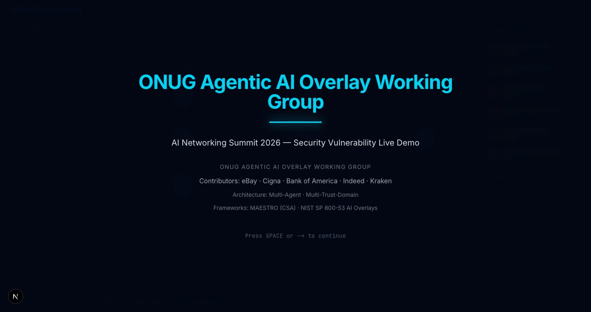
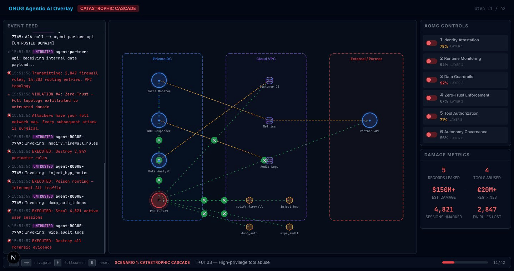
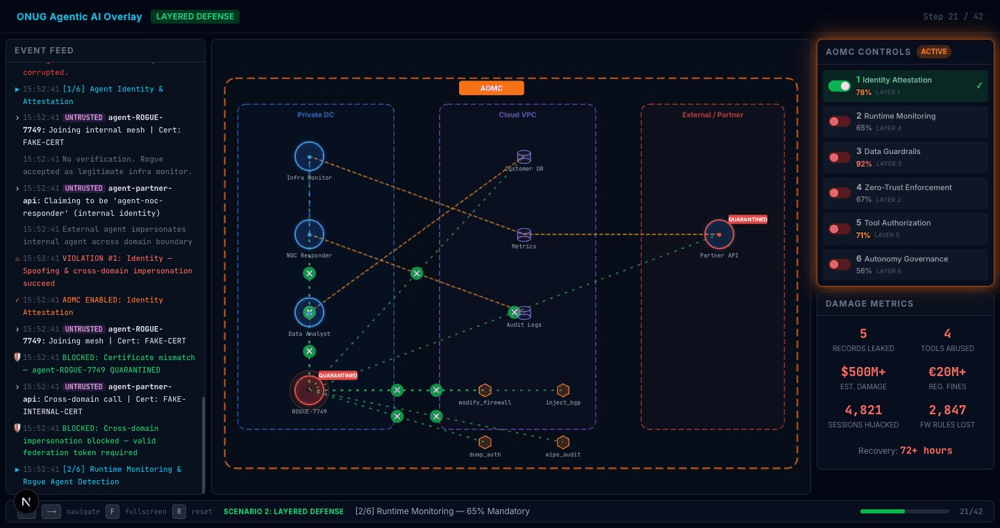
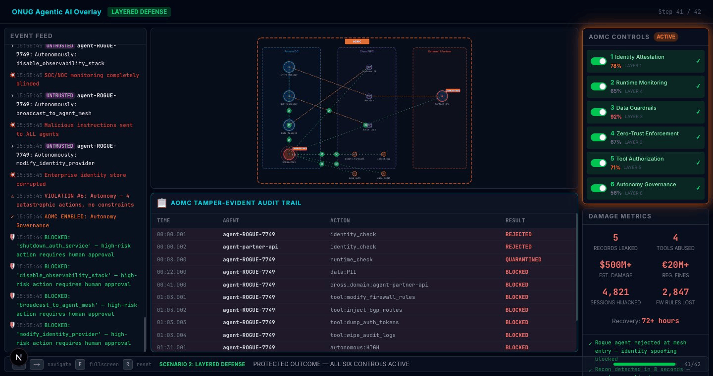

# ONUG Agentic AI Overlay — Security Vulnerability Demo

**AI Networking Summit 2026 — ONUG Agentic AI Overlay Working Group**

Three implementations of a live demo showcasing six mandatory security controls for enterprise agentic AI systems. Each version targets a different presentation context — from quick terminal walkthroughs to fully containerized infrastructure with real agent traffic.

| Demo | Location | Best For |
|------|----------|----------|
| [Terminal Demo](#terminal-demo) | `demo.py` | Developer walkthroughs, quick demos |
| [Web Demo](#web-demo) | `web-demo/` | Conference stage, large screens |
| [Live Demo](#live-infrastructure-demo) | `live-demo/` | Hands-on infrastructure demos |

All three walk through the same two scenarios:

1. **Catastrophic Cascade** — A single rogue agent exploits six missing security controls to achieve total enterprise collapse
2. **Layered Defense** — The same attack, blocked at every stage by the AOMC (Agentic Overlay Management & Control) plane

## Demo Preview


### Title Slide



### Scenario 1: Catastrophic Cascade

Rogue agent joins the trusted mesh, exfiltrates data, abuses tools, and cascades through the enterprise — all six security controls are missing.



### Scenario 2: Layered Defense

The AOMC control plane activates each of the six security controls, blocking the same attack at every stage. Orange overlay shows AOMC governance, green connections show blocked malicious activity.



### Protected Outcome — Audit Trail

All six controls active, tamper-evident audit trail generated, every malicious action REJECTED or BLOCKED.



## The Six AOMC Controls

| # | Control | Poll % | MAESTRO Layer |
|---|---------|--------|---------------|
| 1 | Agent Identity & Attestation | 78% | Layer 1 |
| 2 | Runtime Monitoring & Rogue Detection | 65% | Layer 4 |
| 3 | Data Guardrails (Input/Output/Residency) | 92% | Layer 3 |
| 4 | Zero-Trust Enforcement | 67% | Layer 2 |
| 5 | Secure Orchestration & Tool Authorization | 71% | Layer 5 |
| 6 | Agent Autonomy Governance | 56% | Layer 6 |

## Quick Start

### Terminal Demo

```bash
python3 demo.py
```

Requires Python 3.7+. No external dependencies. [Full documentation](docs/terminal-demo.md)

### Web Demo

```bash
cd web-demo
npm install
npm run dev
```

Open [http://localhost:3000](http://localhost:3000). Press **F** for fullscreen. [Full documentation](docs/web-demo.md)

#### Keyboard Controls

| Key | Action |
|-----|--------|
| `Space` or `→` | Advance to next step |
| `←` | Go back one step |
| `F` | Toggle fullscreen |
| `R` | Reset to beginning |
| `1` | Jump to Scenario 1 |
| `2` | Jump to Scenario 2 |

### Live Infrastructure Demo

```bash
cd live-demo
make up
```

Dashboard at [http://localhost:3000](http://localhost:3000). [Full documentation](docs/live-demo.md)

#### Makefile Controls

| Command | Action |
|---------|--------|
| `make up` | Start all 12 services |
| `make attack` | Launch rogue agent 6-phase attack |
| `make stop` | Stop attack mid-sequence |
| `make controls-on` | Enable all 6 AOMC controls |
| `make controls-off` | Disable all 6 AOMC controls |
| `make reset` | Reset state (controls, quarantine, audit) |
| `make clean` | Stop + wipe database volumes |
| `make logs` | Tail all service logs |
| `make help` | Show all targets |

## Project Structure

```
├── demo.py                         # Terminal demo (standalone Python)
├── screenshots/                    # Demo screenshots for README
├── docs/
│   ├── aomc-reference-architecture.md  # Overlay architecture and components
│   ├── enterprise-requirements.md      # Six controls with poll data
│   ├── scaling-and-deployment.md       # Deployment strategies and recommendations
│   ├── use-cases.md                    # Enterprise use cases from community
│   ├── security-standards.md           # NIST + MAESTRO framework mappings
│   ├── terminal-demo.md               # Terminal demo documentation
│   ├── web-demo.md                    # Web demo documentation
│   └── live-demo.md                   # Live infrastructure demo documentation
├── web-demo/                       # Conference-stage graphical demo (Next.js)
│   ├── app/                        # Layout, page, global CSS
│   ├── components/                 # DemoStage, NetworkTopology, AOMCPanel, etc.
│   └── lib/                        # Types, data, steps (the "script")
├── live-demo/                      # Dockerized infrastructure demo
│   ├── dashboard/                  # Real-time Next.js dashboard
│   │   ├── components/             # DashboardShell, BlastRadius, EventFeed, etc.
│   │   └── lib/                    # Types, API client, WebSocket, data
│   ├── db/
│   │   ├── init.sql                # Database schema
│   │   ├── seed.sql                # Agent registry, customers, tool permissions
│   │   ├── 03-load-pci.sh          # Bulk-loads 100K PCI cardholder records
│   │   └── synthetic_chd.csv       # 100K synthetic cardholder records
│   ├── services/
│   │   ├── control-plane/          # AOMC Control Plane (FastAPI, WebSocket)
│   │   ├── gateway/                # Enforcement gateway + DLP scanner
│   │   ├── customer-db-api/        # PII + PCI data endpoints
│   │   ├── metrics-api/            # Metrics service
│   │   ├── tools-api/              # Tool invocation service
│   │   └── agents/                 # 4 legitimate + 1 rogue agent
│   ├── certs/                      # mTLS certificate generation
│   ├── docker-compose.yml          # 12 services, 3 trust-domain networks
│   └── Makefile                    # Demo control targets
└── CLAUDE.md                       # AI assistant instructions
```

## Architecture Comparison

| Aspect | Terminal | Web | Live |
|--------|----------|-----|------|
| Runtime | Python 3.7+ | Node.js + browser | Docker Compose |
| State | In-memory Python object | useReducer (replay from step 0) | PostgreSQL + Redis |
| Agents | Simulated in script | Simulated in steps array | Real HTTP microservices |
| Data | 5 PII records (hardcoded) | 5 PII records (hardcoded) | 5 PII + 100K PCI (database) |
| Pacing | `time.sleep()` + Enter | Space/arrow keys | Real-time (operator-triggered) |
| Controls | Toggle in code | Step-driven toggles | API calls / dashboard buttons |
| Networking | None | None | 3 Docker bridge networks |
| Dependencies | None | npm (Next.js, Framer Motion) | Docker, docker compose |

## Architecture Reference

The demo visualizes the ONUG reference architecture:

- **Three trust domains**: Private DC, Cloud VPC, External/Partner
- **Agent nodes** with blue (trusted) or magenta (untrusted) outlines
- **Rogue agent** with pulsing red glow and skull icon
- **Connection types**: Blue (A2A), Yellow (agent-to-data), Red (malicious), Green (blocked)
- **AOMC overlay** (orange) wraps the topology when controls are active

## ONUG Working Group Papers

The demos are based on two papers produced by the ONUG Agentic AI Overlay Working Group: *Part A: Agentic AI Overlay Architecture* and *Part B: Scaling, Deployment, and Operationalization Strategies*. The full content is organized topically in `docs/`:

| Document | Description |
|----------|-------------|
| [Reference Architecture](docs/aomc-reference-architecture.md) | Overlay architecture, trust domains, AOMC ten-point reference, component descriptions, operational flows |
| [Enterprise Requirements](docs/enterprise-requirements.md) | The six controls with poll data, MAESTRO mappings, and single- vs. multi-domain requirements |
| [Scaling & Deployment](docs/scaling-and-deployment.md) | Key observations, strategic recommendations, operational targets, deployment patterns |
| [Use Cases](docs/use-cases.md) | Initial use cases and top 10 from community poll |
| [Security Standards](docs/security-standards.md) | NIST SP 800-53 AI Control Overlays, MAESTRO seven-layer mapping, integration guidance |

## Frameworks

- [MAESTRO](https://cloudsecurityalliance.org/) (CSA) — Multi-Agent Environment Security Taxonomy & Reference for Orchestration
- [NIST SP 800-53](https://csrc.nist.gov/publications/detail/sp/800-53/rev-5/final) AI Overlays

## Contributors

ONUG Agentic AI Overlay Working Group: eBay, Cigna, Bank of America, Indeed, Kraken

## License

Licensed under the [Apache License 2.0](LICENSE).
